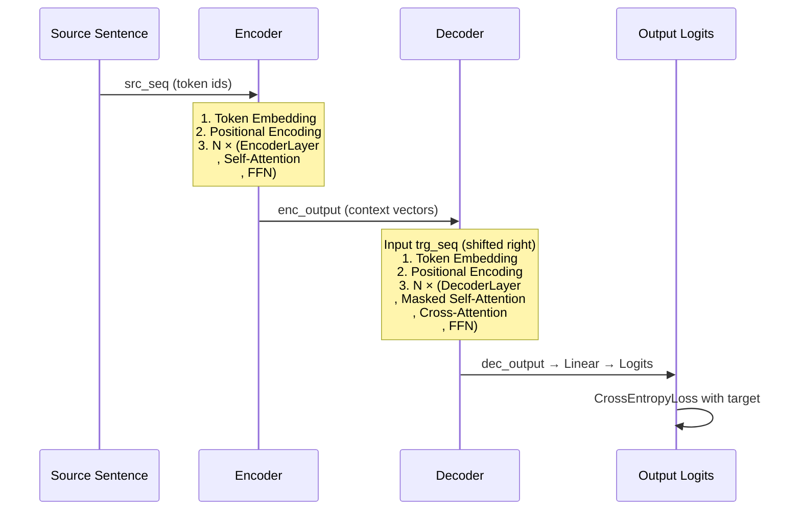
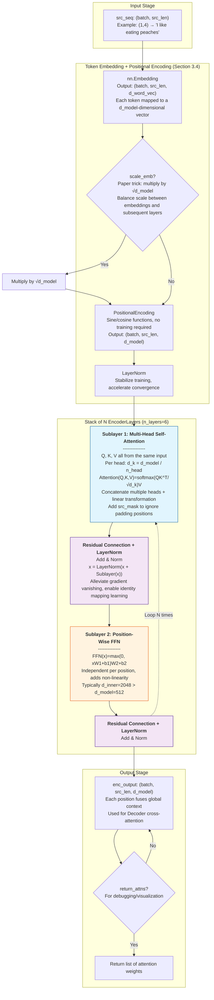
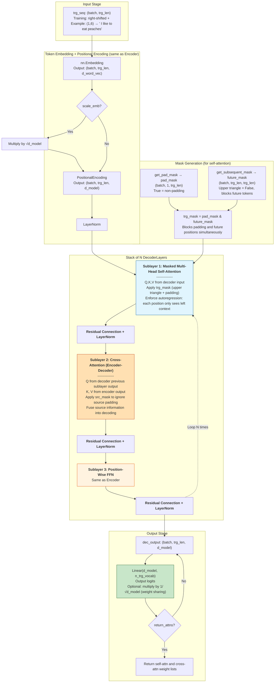
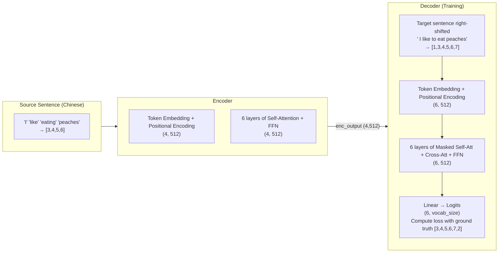

* Translated from [Code_Learning-henry.md](Code_Learning-henry.md) by Doubao
  
Please use Obsidian with the Mermaid plugin for preview\.

- Reference code:
[Implementation project for the Transformer paper](https://github.com/jadore801120/attention-is-all-you-need-pytorch)

# Section 1\. Algorithm Explanation

## 1\. Overall Transformer Flow \(Simplified UML Sequence Style\)



### Data Flow Diagram

\!\[\[Pasted image 20260519195315\.png\|481\]\]

## 2\. Detailed Encoder Flow \(with Transformer algorithm annotations\)



**Key Algorithm Notes \(annotations in diagram\):**

- **Scaled Dot\-Product Attention**: Divide by `√d\_k` to prevent large dot products from saturating softmax gradients\.

- **Multi\-Head Mechanism**: Enables the model to jointly attend to information from different subspaces; each head focuses on distinct patterns \(e\.g\., local vs\. long\-range\)\.

- **Residual Connection**: Facilitates training of deep networks and preserves original input information\.

- **Positional Encoding**: Since self\-attention has no inherent notion of order, fixed sinusoidal encodings inject positional information\.

## 3\. Detailed Decoder Flow \(with Transformer algorithm annotations\)



**Key Algorithm Notes \(annotations in diagram\):**

- **Masked Self\-Attention**: An upper triangular mask \(`subsequent\_mask`\) prevents the model from seeing tokens `t\+1, t\+2\.\.\.` when predicting position `t`, ensuring autoregressive generation\.

- **Cross\-Attention**: Queries from Decoder, keys/values from Encoder\. Allows Decoder to dynamically focus on the most relevant parts of the source sentence at each step \(e\.g\., focusing on \&\#34;peach\&\#34; when generating \&\#34;peaches\&\#34;\)\.

- **Residual \+ Layer Normalization**: Applied after every sublayer \(same as Encoder\) to stabilize deep network training\.

- **Output Projection**: Maps decoder vectors to target vocabulary size, followed by `softmax` to produce probability distributions\.

## 4\. Overall Data Flow \+ Mask Shape Example \(Optional Supplementary Diagram\)



## 5\. Summary of Key Tensor Shape Changes \(for reference\)

|Component|Input Shape|Output Shape|Notes|
|---|---|---|---|
|Token Embedding|`\(batch, seq\_len\)`|`\(batch, seq\_len, d\_model\)`|`d\_model` typically 512|
|Positional Encoding|`\(batch, seq\_len, d\_model\)`|Same shape \(added directly\)|Broadcast to batch dimension|
|EncoderLayer|`\(batch, seq\_len, d\_model\)`|Same shape|Residual inside, no dimension change|
|DecoderLayer|`\(batch, trg\_len, d\_model\)`|Same shape|Same logic|
|Cross\-Attention|Q: `\(batch, trg\_len, d\_model\)`<br>K,V: `\(batch, src\_len, d\_model\)`|`\(batch, trg\_len, d\_model\)`|Output length determined by Q \(target side\)|
|Final Output Projection|`\(batch, trg\_len, d\_model\)`|`\(batch, trg\_len, n\_trg\_vocab\)`|Linear layer without bias|

These flowcharts and tables fully illustrate every step from input to output, and explain Transformer’s core mechanisms \(attention, masking, residual connections, normalization, positional encoding\)\. It is hoped that this annotated version will help you better understand the algorithmic logic behind the code\.

# Section 2\. Key Code Explanation

```Plaintext
I like your example: "Input: <sos> I love you <eos>". I want a detailed breakdown of the training steps, combining your data flow analysis and Transformer code implementation. Walk me through step by step.
```

Alright, I will use the example `\&lt;sos\&gt; I love you \&lt;eos\&gt;` to walk you through the entire training process step by step, combined with the code\.

---

## Assumptions

|Item|Value|
|---|---|
|Source sentence \(German\)|`Ich liebe dich`|
|Target sentence \(Chinese\)|`\&lt;sos\&gt; I love you \&lt;eos\&gt;`|
|batch\_size|1|
|src\_seq\_len|3 \(Ich, liebe, dich\)|
|trg\_seq\_len|5 \(, I, love, you, \)|
|d\_model|512|
|vocab\_size|10000|
|n\_layers|6|
|n\_head|8|
|d\_k = d\_v|64|
|d\_inner|2048|

---

## Step 1: Data Preparation \(train\_save\_point\_v1\.py lines 97\-100\)

### 1\.1 Source Sequence Processing

```Python
src_seq = patch_src(batch.src, opt.src_pad_idx).to(device)
```

- Original shape of `batch\.src`: `\[3, 1\]` \(torchtext default: `\[seq\_len, batch\_size\]`\)

- After transpose by `patch\_src`: `\[1, 3\]`

- Actual values: `\[\[id\_Ich, id\_liebe, id\_dich\]\]`

- `\.to\(device\)`: Move to GPU

### 1\.2 Target Sequence Processing

```Python
trg_seq, gold = map(
    lambda x: x.to(device), patch_trg(batch.trg, opt.trg_pad_idx)
)
```

`patch\_trg` function \(lines 69\-72\):

```Python
def patch_trg(trg, pad_idx):
    trg = trg.transpose(0, 1)                    # [5, 1] → [1, 5]
    trg, gold = trg[:, :-1], trg[:, 1:].contiguous().view(-1)
    return trg, gold
```

|Variable|Value|Shape|Meaning|
|---|---|---|---|
|`trg\_seq`|`\[\&lt;sos\&gt;, I, love, you\]`|`\[1, 4\]`|Decoder input \(remove final `\&lt;eos\&gt;`\)|
|`gold`|`\[I, love, you, \&lt;eos\&gt;\]`|`\[4\]`|Ground truth labels \(remove leading `\&lt;sos\&gt;`\)|

**Why split this way?** The Decoder’s task: given previous tokens, predict the next token\.

---

## Step 2: Build Attention Masks \(Models\.py lines 155\-156\)

### 2\.1 Padding Mask

```Python
src_mask = get_pad_mask(src_seq, self.src_pad_idx)
trg_mask = get_pad_mask(trg_seq, self.trg_pad_idx) & get_subsequent_mask(trg_seq)
```

`get\_pad\_mask` \(line 14\):

```Python
def get_pad_mask(seq, pad_idx):
    return (seq != pad_idx).unsqueeze(-2)
```

- `src\_mask` shape: `\[1, 1, 3\]`, all values `True` \(no padding assumed\)

- `trg\_mask` = **padding mask \&amp; subsequent mask**

### 2\.2 Subsequent Mask \(Causal Mask\)

`get\_subsequent\_mask` \(lines 17\-21\):

```Python
def get_subsequent_mask(seq):
    sz_b, len_s = seq.size()
    subsequent_mask = (1 - torch.triu(
        torch.ones((1, len_s, len_s), device=seq.device), diagonal=1)).bool()
    return subsequent_mask
```

For `trg\_seq` \(length 4\), generates:

```Plaintext
pos0(<sos>) pos1(I) pos2(love) pos3(you)
pos0      [  0,         1,        1,        1      ]  ← Only sees itself
pos1      [  0,         0,        1,        1      ]  ← Sees <sos>, I
pos2      [  0,         0,        0,        1      ]  ← Sees <sos>, I, love
pos3      [  0,         0,        0,        0      ]  ← Sees <sos>, I, love, you
```

`0` = masked \(filled with `\-1e9` in attention\), `1` = visible

---

## Step 3: Encoder Forward Pass \(Models\.py line 158\)

```Python
enc_output, *_ = self.encoder(src_seq, src_mask)
```

### 3\.1 Encoder Internal Flow \(Models\.py lines 59\-75\)

#### 3\.1\.1 Token Embedding

```Python
enc_output = self.src_word_emb(src_seq)
```

- Input: `\[\[id\_Ich, id\_liebe, id\_dich\]\]`, shape `\[1, 3\]`

- Output: `enc\_output`, shape `\[1, 3, 512\]`

- Each word mapped to a 512\-dimensional vector

#### 3\.1\.2 Positional Encoding

```Python
enc_output = self.dropout(self.position_enc(enc_output))
```

`PositionalEncoding` \(lines 31\-49\):

```Python
def forward(self, x):
    return x + self.pos_table[:, :x.size(1)].clone().detach()
```

Positional encoding formula \(sinusoidal from paper\):

```Plaintext
PE(pos, 2i)   = sin(pos / 10000^(2i/d_model))
PE(pos, 2i+1) = cos(pos / 10000^(2i/d_model))
```

- pos0 \(Ich\): `\[sin\(0/1\), cos\(0/1\), sin\(0/10\), cos\(0/10\), \.\.\., sin\(0/10000^31\), cos\(0/10000^31\)\]`

- pos1 \(liebe\): `\[sin\(1/1\), cos\(1/1\), sin\(1/10\), cos\(1/10\), \.\.\., sin\(1/10000^31\), cos\(1/10000^31\)\]`

- pos2 \(dich\): same logic

Positional encoding is **added to word embeddings**, so the model knows token positions\.

#### 3\.1\.3 Layer Normalization \+ Dropout

```Python
enc_output = self.layer_norm(enc_output)
```

#### 3\.1\.4 Pass through 6 EncoderLayers

```Python
for enc_layer in self.layer_stack:
    enc_output, enc_slf_attn = enc_layer(enc_output, slf_attn_mask=src_mask)
```

Each `EncoderLayer` \(Layers\.py lines 13\-22\) has two sublayers:

**Sublayer 1: Self\-Attention**

```Python
enc_output, enc_slf_attn = self.slf_attn(
    enc_input, enc_input, enc_input, mask=slf_attn_mask)
```

- Q = K = V = word embedding \+ positional encoding

- Shape change: `\[1, 3, 512\]` → linear projection → `\[1, 3, 8, 64\]` → transpose → `\[1, 8, 3, 64\]`

- 8 heads compute self\-attention in parallel

- Each head: `Q × K^T / √64` → softmax → multiply by V

- Concatenate 8 heads → `\[1, 3, 512\]`

- Dropout → residual connection → LayerNorm

**Sublayer 2: Position\-wise Feed Forward**

```Python
enc_output = self.pos_ffn(enc_output)
```

`PositionwiseFeedForward` \(SubLayers\.py lines 42\-56\):

```Python
x = self.w_2(F.relu(self.w_1(x)))  # 512 → 2048 → ReLU → 512
x = self.dropout(x)
x += residual                        # Residual connection
x = self.layer_norm(x)               # LayerNorm
```

- Two linear layers: `512 → 2048 → 512`

- ReLU activation in between

- Residual connection \+ LayerNorm

**After 6 layers**, `enc\_output` remains `\[1, 3, 512\]`, but each position now fuses full sentence context\.

---

## Step 4: Decoder Forward Pass \(Models\.py line 159\)

```Python
dec_output, *_ = self.decoder(trg_seq, trg_mask, enc_output, src_mask)
```

### 4\.1 Decoder Internal Flow \(Models\.py lines 86\-106\)

#### 4\.1\.1 Token Embedding \+ Positional Encoding

```Python
dec_output = self.trg_word_emb(trg_seq)          # [1, 4, 512]
dec_output = self.dropout(self.position_enc(dec_output))
dec_output = self.layer_norm(dec_output)
```

#### 4\.1\.2 Pass through 6 DecoderLayers

```Python
for dec_layer in self.layer_stack:
    dec_output, dec_slf_attn, dec_enc_attn = dec_layer(
        dec_output, enc_output, slf_attn_mask=trg_mask, dec_enc_attn_mask=src_mask)
```

Each `DecoderLayer` \(Layers\.py lines 25\-40\) has **three sublayers**:

**Sublayer 1: Masked Self\-Attention**

```Python
dec_output, dec_slf_attn = self.slf_attn(
    dec_input, dec_input, dec_input, mask=slf_attn_mask)
```

- Q = K = V = target sequence embedding \+ positional encoding

- Uses `trg\_mask` \(causal mask\), ensuring pos `t` only sees `0\~t\-1`

- Example: predicting \&\#34;love\&\#34; → only sees `\&lt;sos\&gt;` and \&\#34;I\&\#34;, not \&\#34;you\&\#34; or `\&lt;eos\&gt;`

**Sublayer 2: Cross\-Attention**

```Python
dec_output, dec_enc_attn = self.enc_attn(
    dec_output, enc_output, enc_output, mask=dec_enc_attn_mask)
```

- **Q** = Masked Self\-Attention output \(Decoder side\)

- **K, V** = Encoder output `enc\_output` \(Encoder side\)

- Purpose: Decoder \&\#34;focuses\&\#34; on relevant source sentence tokens when predicting each target token

- Example: predicting \&\#34;I\&\#34; → Cross\-Attention focuses on \&\#34;Ich\&\#34;

**Sublayer 3: Position\-wise Feed Forward**

```Python
dec_output = self.pos_ffn(dec_output)
```

Same as Encoder: `512 → 2048 → ReLU → 512`, with residual \+ LayerNorm\.

**After 6 layers**, `dec\_output` shape = `\[1, 4, 512\]`\.

---

## Step 5: Output Projection \(Models\.py lines 160\-162\)

```Python
seq_logit = self.trg_word_prj(dec_output)
if self.scale_prj:
    seq_logit *= self.d_model ** -0.5
```

- `trg\_word\_prj`: `Linear\(512, 10000, bias=False\)`

- Input: `\[1, 4, 512\]`

- Output: `seq\_logit`, shape `\[1, 4, 10000\]`

- Each position has 10000\-dimensional logits \(unnormalized scores\)

### 5\.1 Flatten

```Python
return seq_logit.view(-1, seq_logit.size(2))
```

- Output: `\[4, 10000\]`

- Row 0: logits for predicting \&\#34;I\&\#34;

- Row 1: logits for predicting \&\#34;love\&\#34;

- Row 2: logits for predicting \&\#34;you\&\#34;

- Row 3: logits for predicting `\&lt;eos\&gt;`

---

## Step 6: Compute Loss \&amp; Accuracy \(train\_save\_point\_v1\.py lines 107\-109\)

```Python
loss, n_correct, n_word = cal_performance(
    pred, gold, opt.trg_pad_idx, smoothing=smoothing
)
```

### 6\.1 Compute Loss \(cal\_loss function, lines 42\-66\)

```Python
gold = gold.contiguous().view(-1)                    # [4]
loss = F.cross_entropy(pred, gold, ignore_index=trg_pad_idx, reduction="sum")
```

- `pred`: `\[4, 10000\]`, 10000\-d logits per position

- `gold`: `\[I, love, you, \&lt;eos\&gt;\]`, shape `\[4\]`, ground truth token IDs

**Cross\-Entropy Calculation \(pos0 example\):**

```Plaintext
pred[0] = [logit_0, logit_1, ..., logit_I_id, ..., logit_9999]
gold[0] = I_id
softmax(pred[0]) = [p_0, p_1, ..., p_I, ..., p_9999]
loss[0] = -log(p_I)
```

Negative log probability of the ground truth token\. Final loss = **sum** of 4 position losses \(`reduction=\&\#34;sum\&\#34;`\)\.

### 6\.2 Compute Accuracy

```Python
pred = pred.max(1)[1]                    # [4], predicted token IDs per position
gold = gold.contiguous().view(-1)        # [4]
non_pad_mask = gold.ne(trg_pad_idx)      # [True, True, True, True]
n_correct = pred.eq(gold).masked_select(non_pad_mask).sum().item()
n_word = non_pad_mask.sum().item()       # 4
```

- `pred\.max\(1\)\[1\]`: token ID with highest probability

- Example: `id\_I` has highest score in `pred\[0\]` → correct prediction

- `n\_correct`: count of correct predictions

- `n\_word`: total non\-padding tokens

---

## Step 7: Backpropagation \(train\_save\_point\_v1\.py lines 110\-118\)

```Python
loss.backward()
torch.nn.utils.clip_grad_norm_(
    model.parameters(), 1.0
)
optimizer.step_and_update_lr()
```

### 7\.1 `loss\.backward\(\)`

- Backpropagate loss through computation graph

- Compute gradient `grad` for every parameter

- All parameters updated:

    - Encoder embeddings, positional encoding, 6×Attention\+FFN

    - Decoder embeddings, positional encoding, 6×Masked Attention\+Cross\-Attention\+FFN

    - Output projection weights

### 7\.2 Gradient Clipping

```Python
torch.nn.utils.clip_grad_norm_(model.parameters(), 1.0)
```

- Prevent gradient explosion

- Scale gradients proportionally if total norm \&gt; 1\.0

### 7\.3 Update Parameters \+ Adjust Learning Rate

```Python
optimizer.step_and_update_lr()
```

- `optimizer\.step\(\)`: update parameters with gradients

- `optimizer\.update\_lr\(\)`: adjust learning rate via Warmup strategy

---

## Complete Data Flow Diagram \(with shapes\)

```Plaintext
Source Sentence: "Ich liebe dich"
┌─────────────────────────────────────────────────────┐
│                    Encoder                            │
│                                                       │
│  [id_Ich, id_liebe, id_dich]                       │
│       ↓ Token Embedding [1,3] → [1,3,512]         │
│       ↓ + Positional Encoding [1,3,512]           │
│       ↓ Dropout + LayerNorm                         │
│  ┌─────────────────────────────────────┐           │
│  │  6 × EncoderLayer                   │           │
│  │  ┌─────────────────────────────┐    │           │
│  │  │ Self-Attention              │    │           │
│  │  │   Q=K=V [1,3,512]          │    │           │
│  │  │   → 8 heads × [1,8,3,64]   │    │           │
│  │  │   → Attention + Concat     │    │           │
│  │  │   → Dropout + Residual + LN│    │           │
│  │  └─────────────────────────────┘    │           │
│  └─────────────────────────────────────┘           │
└─────────────────────────────────────────────────────┘

┌─────────────────────────────────────────────────────┐
│                    Decoder                            │
│                                                       │
│  [<sos>, I, love, you]                               │
│       ↓ Token Embedding [1,4] → [1,4,512]           │
│       ↓ + Positional Encoding [1,4,512]            │
│       ↓ Dropout + LayerNorm + trg_mask              │
│  ┌─────────────────────────────────────┐           │
│  │  6 × DecoderLayer                   │           │
│  │  ┌─────────────────────────────┐    │           │
│  │  │ Masked Self-Attention        │    │           │
│  │  │ Cross-Attention (→ Encoder) │    │           │
│  │  │ FFN + Residual + LN         │    │           │
│  │  └─────────────────────────────┘    │           │
│  └─────────────────────────────────────┘           │
│       ↓ Linear Projection [1,4,512] → [1,4,10000] │
└─────────────────────────────────────────────────────┘
```

---

Yes, you’re right\! The three sublayers of DecoderLayer are:
Sublayer 1: Masked Self\-Attention \(decoder looks at decoder\)
Sublayer 2: Cross\-Attention \(decoder looks at encoder\) ← your question here
Sublayer 3: Position\-wise FFN

```Plaintext
Let’s dive deep into **Sublayer 2: Cross-Attention**.
```

---

## Sublayer 2: Cross\-Attention

```Python
dec_output, dec_enc_attn = self.enc_attn(
    dec_output, enc_output, enc_output, mask=dec_enc_attn_mask)
```

### Parameter Mapping

|MultiHeadAttention Parameter|Input Value|Meaning|
|---|---|---|
|`q` \(Query\)|`dec\_output`|Decoder output \(token to predict\)|
|`k` \(Key\)|`enc\_output`|Encoder output \(source sentence\)|
|`v` \(Value\)|`enc\_output`|Encoder output \(source sentence\)|
|`mask`|`dec\_enc\_attn\_mask`|Source sequence padding mask|

**Key Difference**: In Self\-Attention, Q=K=V come from the same side; in Cross\-Attention, **Q from Decoder, K/V from Encoder**\.

---

## Example Walkthrough

|Item|Value|
|---|---|
|Source sentence|`Ich liebe dich` \(3 tokens\)|
|Target sentence|`\&lt;sos\&gt; I love you \&lt;eos\&gt;` \(5 tokens\)|
|`dec\_output` shape|`\[1, 4, 512\]` \(4 Decoder positions\)|
|`enc\_output` shape|`\[1, 3, 512\]` \(3 Encoder positions\)|

### Detailed Process

Assume Decoder is predicting position 1 \(\&\#34;I\&\#34;\):

**Step 1: Linear Projection**

```Python
q = self.w_qs(dec_output)     # [1, 4, 512] → [1, 4, 512]
k = self.w_ks(enc_output)     # [1, 3, 512] → [1, 3, 512]
v = self.w_vs(enc_output)     # [1, 3, 512] → [1, 3, 512]
```

**Step 2: Split Heads**

```Python
q → [1, 4, 8, 64]  → transpose → [1, 8, 4, 64]
k → [1, 3, 8, 64]  → transpose → [1, 8, 3, 64]
v → [1, 3, 8, 64]  → transpose → [1, 8, 3, 64]
```

**Step 3: Compute Attention**

```Python
attn = Q × K^T / √64
```

For head 0 example:

```Plaintext
Q[0] shape: [4, 64]   (4 Decoder positions, 64-d each)
K[0] shape: [3, 64]   (3 Encoder positions, 64-d each)
attn = Q[0] × K[0]^T / 8  →  [4, 3]
```

Result: `\[4, 3\]` matrix representing **Decoder position attention weights over Encoder positions**:

```Plaintext
Ich    liebe    dich
<sos>     [ 0.3,    0.2,     0.5   ]  ← Focuses most on dich when predicting <sos>
I         [ 0.7,    0.1,     0.2   ]  ← Focuses most on Ich when predicting I
love      [ 0.1,    0.6,     0.3   ]  ← Focuses most on liebe when predicting love
you       [ 0.2,    0.3,     0.5   ]  ← Focuses most on dich when predicting you
```

**This matrix is ****`dec\_enc\_attn`**—it shows which source tokens the Decoder attends to when predicting each target token\.

**Step 4: Softmax \+ Weighted Sum**

```Python
attn = softmax(attn, dim=-1)    # Normalize rows to probabilities
output = attn × V               # [4, 3] × [3, 64] → [4, 64]
```

**Step 5: Concatenate Heads \+ Linear \+ Residual \+ LayerNorm**

```Python
# Concatenate 8 heads: [1, 4, 512]
q = self.fc(q)
q += residual
q = self.layer_norm(q)
```

---

## Why Cross\-Attention?

### Problem with Self\-Attention

In Sublayer 1 \(Masked Self\-Attention\), the Decoder only sees **target language internal context**:

```Plaintext
<sos>  → sees <sos>
I      → sees <sos>, I
love   → sees <sos>, I, love
you    → sees <sos>, I, love, you
```

But the Decoder **has no knowledge of the source sentence**\! It doesn’t know \&\#34;Ich\&\#34; = \&\#34;I\&\#34;, \&\#34;dich\&\#34; = \&\#34;you\&\#34;\.

### Purpose of Cross\-Attention

Cross\-Attention lets the Decoder **focus on relevant source sentence tokens** when predicting each target token:

```Plaintext
Predicting "I" → focus on "Ich" (German "I")
Predicting "love" → focus on "liebe" (German "love")
Predicting "you" → focus on "dich" (German "you")
```

This is **alignment**—mapping source and target tokens together\.

---

## Data Flow Summary

```Plaintext
Decoder pos0 (<sos>)          Decoder pos1 (I)
         │                            │
    Q: [64-d vector]             Q: [64-d vector]
         │                            │
         ▼                            ▼
    Q × K^T / √64               Q × K^T / √64
         │                            │
         ▼                            ▼
   softmax → [0.3, 0.2, 0.5]    softmax → [0.7, 0.1, 0.2]
         │                            │
         ▼                            ▼
   [0.3, 0.2, 0.5] × V           [0.7, 0.1, 0.2] × V
         │                            │
         ▼                            ▼
   Output: [64-d vector]         Output: [64-d vector]
         │                            │
         ▼                            ▼
    8 heads concat → [512-d]      8 heads concat → [512-d]
         │                            │
         ▼                            ▼
    Dropout + Residual + LayerNorm → Next layer
```

---

## Three Sublayer Comparison

|   |   |   |   |
|---|---|---|---|
||Sublayer1: Masked Self-Attention|Sublayer2: Cross-Attention|Sublayer3: FFN|
|Q source|Decoder|Decoder|Sublayer2 output|
|K source|Decoder|**Encoder**|Sublayer2 output|
|V source|Decoder|**Encoder**|Sublayer2 output|
|Purpose|Understand target language internal relations|**Align target with source language**|Non-linear transformation|
|Mask|Causal mask (only left context)|Padding mask (ignore source padding)|None|

