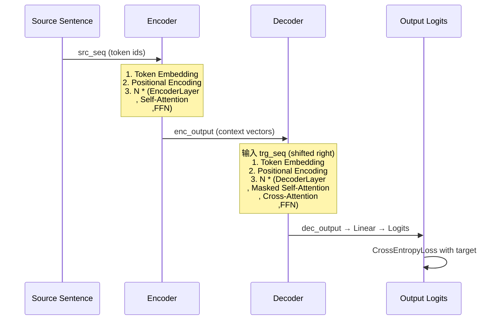
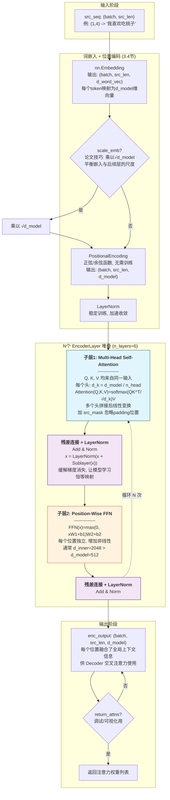
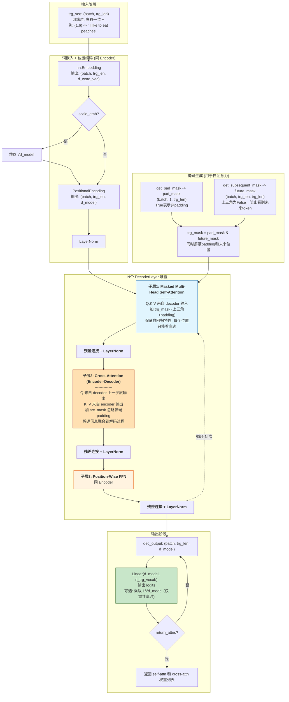
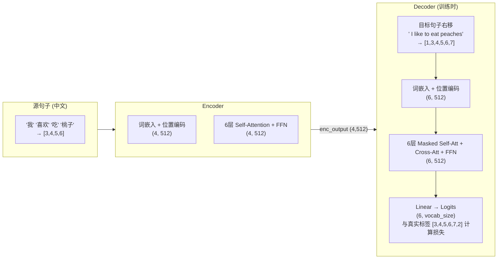

please use obsidian to preview with mermaid plugin 

* Reference code：
[针对Transformer论文的实现项目](https://github.com/jadore801120/attention-is-all-you-need-pytorch)

# Section 1. 算法讲解
## 1. 整体 Transformer 流程（简化 UML 序列风格）




### 数据流图
![[Pasted image 20260519195315.png|481]]

## 2. Encoder 详细流程（含 Transformer 算法注释）

**算法要点说明（图中注释）：**

- **缩放点积注意力**：除以 `√d_k` 防止点积过大导致 softmax 梯度饱和。
    
- **多头机制**：让模型从不同子空间联合关注信息，每个头关注不同的模式（如局部、长距离）。
    
- **残差连接**：使深层网络更容易训练，保留原始输入信息。
    
- **位置编码**：因为自注意力本身没有顺序概念，需要用固定正弦编码注入位置信息。


## 3. Decoder 详细流程（含 Transformer 算法注释）


**算法要点说明（图中注释）：**

- **Masked Self-Attention**：通过上三角掩码（`subsequent_mask`）使模型在预测 `t` 位置时看不到 `t+1, t+2...`，保证自回归生成。
    
- **Cross-Attention**：查询来自 Decoder，键/值来自 Encoder。它允许 Decoder 在每一步动态关注源句子中最相关的部分（如生成 “peaches” 时关注 “桃子”）。
    
- **残差 + 层归一化**：每个子层后都有，和 Encoder 一样，稳定深层训练。
    
- **输出投影**：将解码向量映射到目标词表大小，之后接 `softmax` 得到概率分布。


## 4. 整体数据流 + 掩码形状示例（可选补充图）



## 5. 关键张量形状变化总结（供对照）
|组件|输入形状|输出形状|备注|
|---|---|---|---|
|词嵌入|`(batch, seq_len)`|`(batch, seq_len, d_model)`|`d_model` 通常 512|
|位置编码|`(batch, seq_len, d_model)`|相同形状 (直接相加)|广播到 batch 维度|
|EncoderLayer|`(batch, seq_len, d_model)`|相同形状|内部有残差, 维度不变|
|DecoderLayer|`(batch, trg_len, d_model)`|相同形状|同理|
|Cross-Attention|Q: `(batch, trg_len, d_model)`  <br>K,V: `(batch, src_len, d_model)`|`(batch, trg_len, d_model)`|输出长度由 Q（目标端）决定|
|最终输出投影|`(batch, trg_len, d_model)`|`(batch, trg_len, n_trg_vocab)`|线性层无 bias|

这些流程图和表格完整展示了从输入到输出的每一步，并且说明了 Transformer 的核心机制（注意力、掩码、残差、归一化、位置编码）。希望这个带注释的版本能帮助你更深入地理解代码背后的算法逻辑。


# Section 2 关键代码讲解

```
我觉的你这个例子“输入: <sos> 我 爱 你 <eos> ”很好，我想详细了解下训练的详细步骤，结合你分析的数据流图和Transformer的代码实现，给我一步一步讲讲明白
```


好的，我用 `<sos> 我 爱 你 <eos>` 这个例子，结合代码，一步一步带你走完整个训练过程。

---

## 假设场景

| 项目 | 值 |
|------|-----|
| 源句子（德语） | `Ich liebe dich` |
| 目标句子（中文） | `<sos> 我 爱 你 <eos>` |
| batch_size | 1 |
| src_seq_len | 3（Ich, liebe, dich） |
| trg_seq_len | 5（<sos>, 我, 爱, 你, <eos>） |
| d_model | 512 |
| vocab_size | 10000 |
| n_layers | 6 |
| n_head | 8 |
| d_k = d_v | 64 |
| d_inner | 2048 |

---

## 第一步：数据准备（train_save_point_v1.py 第97-100行）

### 1.1 源序列处理

```python
src_seq = patch_src(batch.src, opt.src_pad_idx).to(device)
```

- `batch.src` 原始形状：`[3, 1]`（torchtext 默认 `[seq_len, batch_size]`）
- `patch_src` 转置后：`[1, 3]`
- 实际值：`[[id_Ich, id_liebe, id_dich]]`
- `.to(device)` 移到 GPU

### 1.2 目标序列处理

```python
trg_seq, gold = map(
    lambda x: x.to(device), patch_trg(batch.trg, opt.trg_pad_idx)
)
```

`patch_trg` 函数（第69-72行）：

```python
def patch_trg(trg, pad_idx):
    trg = trg.transpose(0, 1)                    # [1, 5] → [5, 1] → [1, 5]
    trg, gold = trg[:, :-1], trg[:, 1:].contiguous().view(-1)
    return trg, gold
```

| 变量 | 值 | 形状 | 含义 |
|------|-----|------|------|
| `trg_seq` | `[<sos>, 我, 爱, 你]` | `[1, 4]` | Decoder 输入（去掉最后一个 `<eos>`） |
| `gold` | `[我, 爱, 你, <eos>]` | `[4]` | 真实标签（去掉第一个 `<sos>`） |

**为什么这样切分？** 因为 Decoder 要做的是：给定前面的词，预测下一个词。

---

## 第二步：构建注意力掩码（Models.py 第155-156行）

### 2.1 Padding 掩码

```python
src_mask = get_pad_mask(src_seq, self.src_pad_idx)
trg_mask = get_pad_mask(trg_seq, self.trg_pad_idx) & get_subsequent_mask(trg_seq)
```

`get_pad_mask`（第14行）：

```python
def get_pad_mask(seq, pad_idx):
    return (seq != pad_idx).unsqueeze(-2)
```

- `src_mask` 形状：`[1, 1, 3]`，所有位置都是 `True`（假设没有 padding）
- `trg_mask` 是 **padding 掩码 & 后续掩码**

### 2.2 后续掩码（因果掩码）

`get_subsequent_mask`（第17-21行）：

```python
def get_subsequent_mask(seq):
    sz_b, len_s = seq.size()
    subsequent_mask = (1 - torch.triu(
        torch.ones((1, len_s, len_s), device=seq.device), diagonal=1)).bool()
    return subsequent_mask
```

对于 `trg_seq`（长度 4），生成：

```
     位置0(<sos>)  位置1(我)  位置2(爱)  位置3(你)
位置0  [  0,         1,        1,        1      ]  ← 只能看到自己
位置1  [  0,         0,        1,        1      ]  ← 能看到 <sos>, 我
位置2  [  0,         0,        0,        1      ]  ← 能看到 <sos>, 我, 爱
位置3  [  0,         0,        0,        0      ]  ← 能看到 <sos>, 我, 爱, 你
```

`0` = 屏蔽（attention 中会被填 `-1e9`），`1` = 可见

---

## 第三步：Encoder 前向传播（Models.py 第158行）

```python
enc_output, *_ = self.encoder(src_seq, src_mask)
```

### 3.1 Encoder 内部流程（Models.py 第59-75行）

#### 3.1.1 词嵌入

```python
enc_output = self.src_word_emb(src_seq)
```

- 输入：`[[id_Ich, id_liebe, id_dich]]`，形状 `[1, 3]`
- 输出：`enc_output`，形状 `[1, 3, 512]`
- 每个词被映射为一个 512 维的向量

#### 3.1.2 位置编码

```python
enc_output = self.dropout(self.position_enc(enc_output))
```

`PositionalEncoding`（第31-49行）：

```python
def forward(self, x):
    return x + self.pos_table[:, :x.size(1)].clone().detach()
```

位置编码公式（论文中的正弦函数）：

```
PE(pos, 2i)   = sin(pos / 10000^(2i/d_model))
PE(pos, 2i+1) = cos(pos / 10000^(2i/d_model))
```

- 位置 0（Ich）：`[sin(0/1), cos(0/1), sin(0/10), cos(0/10), ..., sin(0/10000^31), cos(0/10000^31)]`
- 位置 1（liebe）：`[sin(1/1), cos(1/1), sin(1/10), cos(1/10), ..., sin(1/10000^31), cos(1/10000^31)]`
- 位置 2（dich）：同理

位置编码被**加到词向量上**，这样模型就能知道每个词的位置。

#### 3.1.3 层归一化 + Dropout

```python
enc_output = self.layer_norm(enc_output)
```

#### 3.1.4 经过 6 层 EncoderLayer

```python
for enc_layer in self.layer_stack:
    enc_output, enc_slf_attn = enc_layer(enc_output, slf_attn_mask=src_mask)
```

每层 `EncoderLayer`（Layers.py 第13-22行）包含两个子层：

**子层 1：Self-Attention**

```python
enc_output, enc_slf_attn = self.slf_attn(
    enc_input, enc_input, enc_input, mask=slf_attn_mask)
```

- Q = K = V = 词向量 + 位置编码
- 形状变化：`[1, 3, 512]` → 线性投影 → `[1, 3, 8, 64]` → transpose → `[1, 8, 3, 64]`
- 8 个 head 并行计算 Self-Attention
- 每个 head 计算 `Q × K^T / √64` → softmax → 乘以 V
- 拼接 8 个 head 的输出 → `[1, 3, 512]`
- Dropout → 残差连接 → LayerNorm

**子层 2：Position-wise Feed Forward**

```python
enc_output = self.pos_ffn(enc_output)
```

`PositionwiseFeedForward`（SubLayers.py 第42-56行）：

```python
x = self.w_2(F.relu(self.w_1(x)))  # 512 → 2048 → ReLU → 512
x = self.dropout(x)
x += residual                        # 残差连接
x = self.layer_norm(x)               # LayerNorm
```

- 两层线性层：`512 → 2048 → 512`
- 中间用 ReLU 激活
- 同样有残差连接 + LayerNorm

**经过 6 层后**，`enc_output` 形状仍为 `[1, 3, 512]`，但每个位置的信息已经融合了整个句子的上下文。

---

## 第四步：Decoder 前向传播（Models.py 第159行）

```python
dec_output, *_ = self.decoder(trg_seq, trg_mask, enc_output, src_mask)
```

### 4.1 Decoder 内部流程（Models.py 第86-106行）

#### 4.1.1 词嵌入 + 位置编码

```python
dec_output = self.trg_word_emb(trg_seq)          # [1, 4, 512]
dec_output = self.dropout(self.position_enc(dec_output))
dec_output = self.layer_norm(dec_output)
```

#### 4.1.2 经过 6 层 DecoderLayer

```python
for dec_layer in self.layer_stack:
    dec_output, dec_slf_attn, dec_enc_attn = dec_layer(
        dec_output, enc_output, slf_attn_mask=trg_mask, dec_enc_attn_mask=src_mask)
```

每层 `DecoderLayer`（`Layers.py` 第25-40行）包含**三个子层**：

**子层 1：Masked Self-Attention**

```python
dec_output, dec_slf_attn = self.slf_attn(
    dec_input, dec_input, dec_input, mask=slf_attn_mask)
```

- Q = K = V = 目标序列的词向量 + 位置编码
- 使用 `trg_mask`（因果掩码），确保位置 `t` 只能看到 `0~t-1`
- 例如：预测"爱"时，只能看到 `<sos>` 和"我"，看不到"你"和`<eos>`

**子层 2：Cross-Attention**

```python
dec_output, dec_enc_attn = self.enc_attn(
    dec_output, enc_output, enc_output, mask=dec_enc_attn_mask)
```

- **Q** = Masked Self-Attention 的输出（Decoder 侧）
- **K, V** = Encoder 的输出 `enc_output`（Encoder 侧）
- 作用：Decoder 在预测每个词时，"关注"源句子中的相关信息
- 例如：预测"我"时，Cross-Attention 会让模型关注"Ich"

**子层 3：Position-wise Feed Forward**

```python
dec_output = self.pos_ffn(dec_output)
```

和 Encoder 一样，`512 → 2048 → ReLU → 512`，带残差连接 + LayerNorm。

**经过 6 层后**，`dec_output` 形状为 `[1, 4, 512]`。

---

## 第五步：输出投影（`Models.py` 第160-162行）

```python
seq_logit = self.trg_word_prj(dec_output)
if self.scale_prj:
    seq_logit *= self.d_model ** -0.5
```

- `trg_word_prj`：`Linear(512, 10000, bias=False)`
- 输入：`[1, 4, 512]`
- 输出：`seq_logit`，形状 `[1, 4, 10000]`
- 每个位置有 10000 维的 logits（未归一化的分数）

### 5.1 展平

```python
return seq_logit.view(-1, seq_logit.size(2))
```

- 输出：`[4, 10000]`
- 第 0 行：预测"我"的 logits
- 第 1 行：预测"爱"的 logits
- 第 2 行：预测"你"的 logits
- 第 3 行：预测`<eos>`的 logits

---

## 第六步：计算 Loss 和准确率（`train_save_point_v1.py` 第107-109行）

```python
loss, n_correct, n_word = cal_performance(
    pred, gold, opt.trg_pad_idx, smoothing=smoothing
)
```

### 6.1 计算 Loss（`cal_loss` 函数，第42-66行）

```python
gold = gold.contiguous().view(-1)                    # [4]
loss = F.cross_entropy(pred, gold, ignore_index=trg_pad_idx, reduction="sum")
```

- `pred`：`[4, 10000]`，每个位置 10000 维的 logits
- `gold`：`[我, 爱, 你, <eos>]`，形状 `[4]`，每个是真实 token 的 ID

**Cross-Entropy 计算过程**（以第 0 个位置为例）：

```
pred[0] = [logit_0, logit_1, ..., logit_我_id, ..., logit_9999]
gold[0] = 我_id

softmax(pred[0]) = [p_0, p_1, ..., p_我, ..., p_9999]
loss[0] = -log(p_我)
```

即：对真实标签对应的 token 的概率取负对数。

最终 loss 是 4 个位置 loss 的**求和**（`reduction="sum"`）。

### 6.2 计算准确率

```python
pred = pred.max(1)[1]                    # [4]，每个位置预测的 token ID
gold = gold.contiguous().view(-1)        # [4]
non_pad_mask = gold.ne(trg_pad_idx)      # [True, True, True, True]
n_correct = pred.eq(gold).masked_select(non_pad_mask).sum().item()
n_word = non_pad_mask.sum().item()       # 4
```

- `pred.max(1)[1]`：取概率最大的 token ID
- 例如：`pred[0]` 中 `id_我` 的分数最高 → 预测正确
- `n_correct`：预测正确的 token 数量
- `n_word`：非 padding 的 token 总数

---

## 第七步：反向传播（`train_save_point_v1.py` 第110-118行）

```python
loss.backward()

torch.nn.utils.clip_grad_norm_(
    model.parameters(), 1.0
)

optimizer.step_and_update_lr()
```

### 7.1 `loss.backward()`

- 从 loss 开始，沿计算图反向传播
- 计算每个参数的梯度 `grad`
- 涉及的所有参数都被更新：
  - Encoder 的词嵌入、位置编码、6 层 Attention + FFN
  - Decoder 的词嵌入、位置编码、6 层 Masked Attention + Cross-Attention + FFN
  - 输出投影层的权重

### 7.2 梯度裁剪

```python
torch.nn.utils.clip_grad_norm_(model.parameters(), 1.0)
```

- 防止梯度爆炸
- 如果所有参数的梯度范数超过 1.0，则按比例缩放

### 7.3 更新参数 + 调整学习率

```python
optimizer.step_and_update_lr()
```

- `optimizer.step()`：用梯度更新所有参数
- `optimizer.update_lr()`：按 Warmup 策略调整学习率

---

## 完整数据流图（带形状）

```
源句子: "Ich liebe dich"
┌─────────────────────────────────────────────────────┐
│                    Encoder                          │
│                                                     │
│  [id_Ich, id_liebe, id_dich]                       │
│       ↓ 词嵌入 [1,3] → [1,3,512]                   │
│       ↓ + 位置编码 [1,3,512]                       │
│       ↓ Dropout + LayerNorm                        │
│  ┌─────────────────────────────────────┐           │
│  │  6 × EncoderLayer                   │           │
│  │  ┌─────────────────────────────┐    │           │
│  │  │ Self-Attention              │    │           │
│  │  │   Q=K=V [1,3,512]          │    │           │
│  │  │   → 8 heads × [1,8,3,64]   │    │           │
│  │  │   → Attention + Concat     │    │           │
│  │  │   → Dropout + Residual + LN│    │           │
│  │  └─────────────────────────────

```


对，你说得对！DecoderLayer 的三个子层顺序是：


子层1: Masked Self-Attention  (dec 看 dec)
子层2: Cross-Attention        (dec 看 enc)  ← 你问的这里
子层3: Position-wise FFN
```

让我详细讲**子层 2：Cross-Attention**。

---

## 子层 2：Cross-Attention（交叉注意力）

```python
dec_output, dec_enc_attn = self.enc_attn(
    dec_output, enc_output, enc_output, mask=dec_enc_attn_mask)
```

### 参数对应关系

| MultiHeadAttention 参数 | 传入值 | 含义 |
|------------------------|--------|------|
| `q` (Query) | `dec_output` | Decoder 的输出（当前要预测的词） |
| `k` (Key) | `enc_output` | Encoder 的输出（源句子） |
| `v` (Value) | `enc_output` | Encoder 的输出（源句子） |
| `mask` | `dec_enc_attn_mask` | 源序列的 padding 掩码 |

**关键区别**：Self-Attention 中 Q=K=V 都来自同一侧；Cross-Attention 中 **Q 来自 Decoder，K 和 V 来自 Encoder**。

---

## 用例子说明

| 项目 | 值 |
|------|-----|
| 源句子 | `Ich liebe dich`（3 个词） |
| 目标句子 | `<sos> 我 爱 你 <eos>`（5 个词） |
| `dec_output` 形状 | `[1, 4, 512]`（Decoder 的 4 个位置） |
| `enc_output` 形状 | `[1, 3, 512]`（Encoder 的 3 个位置） |

### 具体过程

假设 Decoder 正在预测第 1 个位置（"我"）：

**Step 1：线性投影**

```python
q = self.w_qs(dec_output)     # [1, 4, 512] → [1, 4, 512]
k = self.w_ks(enc_output)     # [1, 3, 512] → [1, 3, 512]
v = self.w_vs(enc_output)     # [1, 3, 512] → [1, 3, 512]
```

**Step 2：拆分 head**

```python
q → [1, 4, 8, 64]  → transpose → [1, 8, 4, 64]
k → [1, 3, 8, 64]  → transpose → [1, 8, 3, 64]
v → [1, 3, 8, 64]  → transpose → [1, 8, 3, 64]
```

**Step 3：计算 Attention**

```python
attn = Q × K^T / √64
```

以第 0 个 head 为例：

```
Q[0] 形状: [4, 64]   （Decoder 的 4 个位置，每个 64 维）
K[0] 形状: [3, 64]   （Encoder 的 3 个位置，每个 64 维）

attn = Q[0] × K[0]^T / 8  →  [4, 3]
```

结果是一个 `[4, 3]` 的矩阵，表示 **Decoder 的每个位置** 对 **Encoder 的每个位置** 的注意力权重：

```
              Ich    liebe    dich
<sos>     [ 0.3,    0.2,     0.5   ]  ← 预测<sos>时最关注dich
我        [ 0.7,    0.1,     0.2   ]  ← 预测"我"时最关注Ich
爱        [ 0.1,    0.6,     0.3   ]  ← 预测"爱"时最关注liebe
你        [ 0.2,    0.3,     0.5   ]  ← 预测"你"时最关注dich
```

**这个矩阵就是 `dec_enc_attn`**，它告诉我们 Decoder 在预测每个目标词时，"看"向了源句子的哪些词。

**Step 4：Softmax + 加权求和**

```python
attn = softmax(attn, dim=-1)    # 每行归一化为概率分布
output = attn × V               # [4, 3] × [3, 64] → [4, 64]
```

**Step 5：拼接所有 head + 线性投影 + 残差 + LayerNorm**

```python
# 8 个 head 的输出拼接: [1, 4, 512]
q = self.fc(q)
q += residual
q = self.layer_norm(q)
```

---

## 为什么要 Cross-Attention？

### Self-Attention 的问题

在子层 1（Masked Self-Attention）中，Decoder 只看到了**目标语言内部**的信息：

```
<sos>  → 看到 <sos>
我     → 看到 <sos>, 我
爱     → 看到 <sos>, 我, 爱
你     → 看到 <sos>, 我, 爱, 你
```

但 Decoder **完全不知道源句子是什么**！它不知道"Ich"对应"我"，"dich"对应"你"。

### Cross-Attention 的作用

Cross-Attention 让 Decoder 在预测每个词时，能够**关注源句子中的相关信息**：

```
预测"我"时 → 关注 "Ich"（德语的"我"）
预测"爱"时 → 关注 "liebe"（德语的"爱"）
预测"你"时 → 关注 "dich"（德语的"你"）
```

这就是**对齐（Alignment）**的过程——把源语言和目标语言的词对应起来。

---

## 数据流总结

```
Decoder 位置 0 (<sos>)          Decoder 位置 1 (我)
         │                            │
    Q: [64维向量]                 Q: [64维向量]
         │                            │
         ▼                            ▼
    Q × K^T / √64               Q × K^T / √64
         │                            │
         ▼                            ▼
   softmax → [0.3, 0.2, 0.5]    softmax → [0.7, 0.1, 0.2]
         │                            │
         ▼                            ▼
   [0.3, 0.2, 0.5] × V           [0.7, 0.1, 0.2] × V
         │                            │
         ▼                            ▼
   输出: [64维向量]               输出: [64维向量]
         │                            │
         ▼                            ▼
    8个head拼接 → [512维]          8个head拼接 → [512维]
         │                            │
         ▼                            ▼
    Dropout + Residual + LayerNorm → 下一层
```

---

## 三层对比

| | 子层1: Masked Self-Attention | 子层2: Cross-Attention | 子层3: FFN |
|---|---|---|---|
| Q 来源 | Decoder | Decoder | 子层2输出 |
| K 来源 | Decoder | **Encoder** | 子层2输出 |
| V 来源 | Decoder | **Encoder** | 子层2输出 |
| 作用 | 理解目标语言内部关系 | **将目标与源语言对齐** | 非线性变换 |
| 掩码 | 因果掩码（看前面） | padding 掩码（不看padding） | 无 |